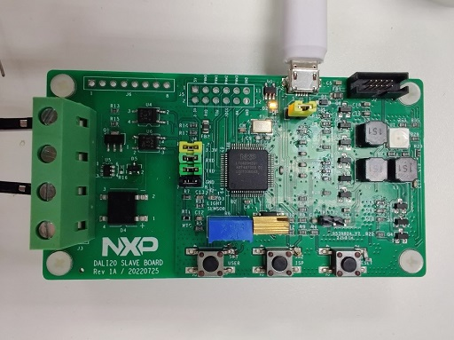
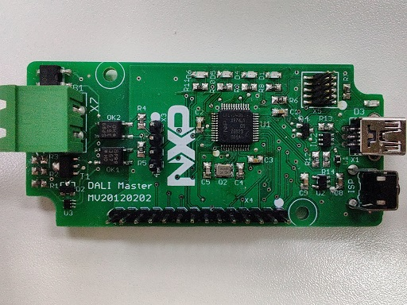
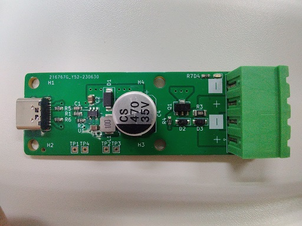
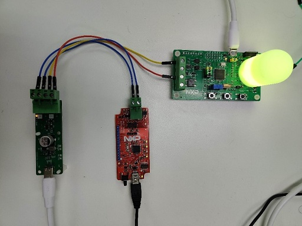
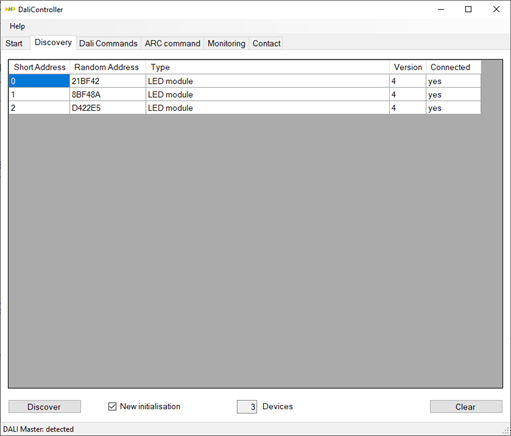

# NXP Application Code Hub

## Smart lighting LED bulb using LPC860
This is the source code for using LPC860 as an IEC-62386 compatible smart RGB light bulb,
and is the default firmware for the smart lighting control gear board.

#### Boards: LPC860 Smart Lighting Demo Board
#### Categories: HMI
#### Peripherals: ADC, TIMER, PWM, DMA
#### Toolchains: MCUXpresso IDE

## Table of Contents
1. [Software](#step1)
2. [Hardware](#step2)
3. [Setup](#step3)
4. [Using The GUI Software](#step4)
5. [FAQs](#step5) 
6. [Support](#step6)
7. [Release Notes](#step7)

## 1. Software
1. Controller software v2.0 available at:
[NXP Community](https://community.nxp.com/t5/LPC-Microcontrollers-Knowledge/DALI-on-LPC-Microcontrollers/ta-p/1128301)
2. MCUXpresso IDE v11.8.0

## 2. Hardware
### LPC860 Smart Lighting Control Gear Board Rev. 1A

### LPC1343 Controller Board Rev. 20120202

### Power Supply Board Rev. A

*Please contact NXP for the ordering information of the boards.*

### Typical Hardware Setup
Connect the Phoenix connectors as described in the following image:

> The polarity of each boards are not relavent, and can be connected both ways.

> More than one control gear board can be connected to the bus at the same time, they will be individually addressed.

> Use USB micro cable to power the Control Gear board, USB mini cable to connect the Controller Board to PC, and USB-C cable to the power supply.

## 3. Setup

### 3.1 Import Project
Clone the project, open the MCUXpresso IDE,
then select `Import project(s) from file system` from Quick Start panel.

> You will need the SDK for LPC865 installed on your MCUXpresso IDE, follow the instruction if you have not done so.
> You will be promped to install one.

### 3.2 Build and Flash Project
1. Click Build button from the toolbar, then wait for the build to complete.
2. Connect the debugger to the SWD connector J2 on the target board, either J-Link or CMSIS-DAP compatible probes can be used.
3. Select the GUI flash tool from toolbar to program the executable to the board.

## 4. Using The GUI Software
1. Launch "DaliController" from Windows start menu, the controller board should be identified.
2. Switch to the "Discovery" tab and perform a discovery with "New initialisation" checkbox ticked.
3. Each Control Gear board should be identified as 3 different "LED module" devices in the list.
4. Switch to the "ARC command" tab, control the brightness of each LEDs using the sliders.

> Individual commands can be tested using the "Dali Commands" tab.

## 5. FAQs
*No FAQs have been identified for this project.*

## 6. Support
*Please contact NXP for additional support.*

#### Project Metadata
<!----- Boards ----->

<!----- Categories ----->

<!----- Peripherals ----->
   

<!----- Toolchains ----->

Questions regarding the content/correctness of this example can be entered as Issues within this GitHub repository.

>**Warning**: For more general technical questions regarding NXP Microcontrollers and the difference in expected funcionality, enter your questions on the [NXP Community Forum](https://community.nxp.com/)

## 7. Release Notes
| Version | Description / Update                           | Date                        |
|:-------:|------------------------------------------------|----------------------------:|
| 1.0     | Initial release on Application Code Hub        | September 22nd 2023 |

